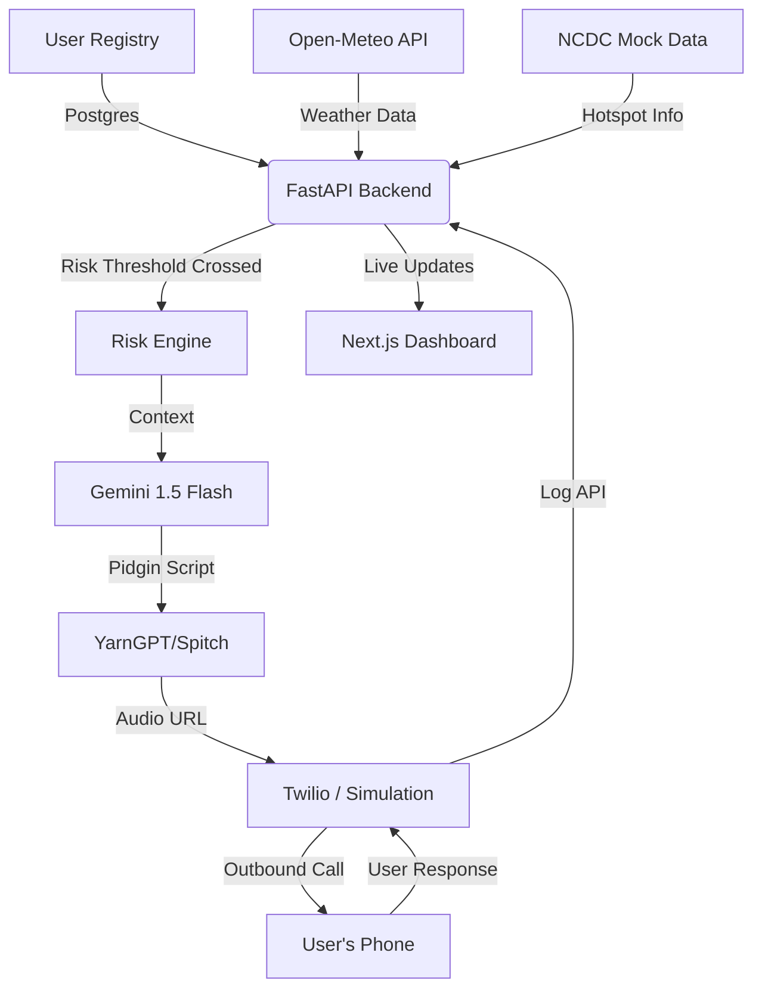

# Sabi Health 🩺🤖
### "Your AI neighbor that calls before sickness catches you."

[](https://fastapi.tiangolo.com/)
[](https://reactjs.org/)
[](https://deepmind.google/technologies/gemini/)
[](https://tailwindcss.com/)

---

## 🚀 The Vision
Healthcare in Nigeria is largely **reactive**—people seek help only after symptoms become severe. **Sabi Health** shifts the paradigm to **proactive prevention**. 

By combining real-time environmental data (weather) and epidemiological insights (hotspot tracking) with culturally resonant Voice AI, Sabi Health places outbound calls to at-risk individuals *before* they fall ill. It converts technical public health bulletins into actionable, neighborly advice delivered in authentic Nigerian Pidgin.

## 🛠️ How It Works (The Core Innovation)

### 1. The Multi-Layered Risk Engine
The system doesn't just wait for a manual trigger. It monitors:
- **Real-time Weather**: Integrates with **Open-Meteo API** to track rainfall and humidity. High rainfall (>15mm) triggers malaria prevention alerts.
- **Disease Hotspots**: Tracks LGA-level data (mock NCDC) for outbreaks like Lassa Fever.

### 2. Culturally Resonant Generative AI
Using **Gemini 1.5 Flash**, Sabi Health generates personalized scripts that don't sound like robots. 
> *"Abeg, make sure say you cover your food well well, so rat no go touch am. Disease for Kano don high now."*
This creates trust and increases the likelihood of preventive action.

### 3. Voice-First Accessibility
Recognizing that many at-risk individuals use basic feature phones, the system is designed for **Voice**. 
- **TTS Integration**: Uses **YarnGPT/Spitch** to deliver natural Nigerian accents.
- **Outbound Telephony**: Integrated with **Twilio**, with a fallback simulation dashboard for areas with limited connectivity.

---

## 🏗️ Technical Architecture



---

## ⚖️ Judging Criteria Alignment

| Criteria | Why We Win |
| :--- | :--- |
| **Technology (7/7)** | Seamless integration of 4+ APIs (Weather, AI, Voice, Database). Robust Async FastAPI backend with PostgreSQL. |
| **Design (3/3)** | Voice-first UX removes technical barriers. Dashboard uses Tailwind v4 and Radix UI for a premium, informative experience. |
| **Business (6/6)** | Highly scalable. Addresses a multi-billion dollar economic burden by reducing hospitalizations via prevention. |
| **Impact (4/4)** | Directly targets life-threatening diseases (Lassa, Malaria) in vulnerable regions using accessible technology. |

---

## 💻 Tech Stack
- **Backend**: FastAPI, PostgreSQL (async), SQLAlchemy, Pydantic.
- **Frontend**: React (Vite), Tailwind CSS v4, Motion (Framer), Radix UI.
- **AI/ML**: Google Gemini 1.5 Flash (Generative Logic).
- **Communication**: Twilio (Voice), YarnGPT (Natural TTS).
- **Infrastructure**: Python 3.10+, Node.js 18+.

---

## 🏃‍♂️ Quick Start (Demo Mode)

### Prerequisites
- Python 3.10+
- Node.js 18+
- Gemini API Key

### Installation
1. **Backend**:
   ```bash
   cd backend
   pip install -r requirements.txt
   # Set GOOGLE_API_KEY in .env
   python main.py
   ```
2. **Frontend**:
   ```bash
   cd frontend/frontend
   npm install
   npm run dev
   ```

3. **Try the Demo**:
   Register a user on the dashboard, select a "High Risk" LGA (e.g., Kano), and click **"Trigger Health Call"**.

---
*Developed for the cavista hackathon 2026. Making health prevention a simple call away.*
